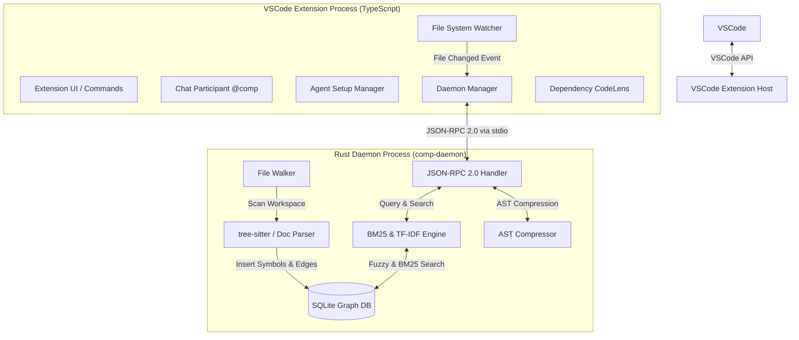

# comP Architecture & Design Document

comP is an ultra-lightweight local code context indexer and VSCode extension designed to provide AI coding agents with the optimal repository context while saving token usage cost.
This document outlines the system architecture, component design, data structures, IPC protocol, and core algorithms of comP.

---

## 1. Overall System Architecture

comP is designed as a two-tier system consisting of a **TypeScript Frontend (VSCode Extension)** and a **Rust Backend (Daemon)**.
The frontend and backend communicate asynchronously via **JSON-RPC 2.0** over standard input/output (`stdin` / `stdout`).



---

## 2. Frontend: VSCode Extension (TypeScript)

The frontend manages user interactions, workspace file changes, and automates agent configuration setups.

### Key Components

1. **`DaemonManager` ([DaemonManager.ts](file:///e:/dev/comP/src/daemon/DaemonManager.ts))**
   - Manages the lifecycle of the Rust daemon (`comp-daemon`). It locates platform-specific binaries (`comp-daemon-win.exe`, `comp-daemon-macos`, `comp-daemon-linux`) and spawns them as a background process.
   - Buffers raw stdio stream data, matches JSON-RPC Request/Response IDs, and handles timeout/auto-reconnection if the daemon exits unexpectedly.

2. **`SessionMemoryManager` ([sessionMemory.ts](file:///e:/dev/comP/src/mcp/sessionMemory.ts))**
   - Persists MCP tool calls (queries, matched symbols, and token statistics) in `.comp/session-memory.json` per session.
   - Listens to VSCode file modification events (`workspace.onDidChangeTextDocument`) to mark historically matched file contexts as `stale` if they were changed after the query.

3. **`AgentSetupManager` ([AgentSetup.ts](file:///e:/dev/comP/src/mcp/AgentSetup.ts))**
   - Automatically registers the comP daemon inside the MCP configuration files of popular coding agents.
   - Supports automated config merging for GitHub Copilot (`.vscode/mcp.json`), Cline, Cursor, Windsurf, and other major systems.

4. **`DependencyCodeLensProvider` ([CodeLens.ts](file:///e:/dev/comP/src/ui/CodeLens.ts))**
   - Injects visual indicators ("X dependents") above function and class declarations, allowing developers to inspect upstream dependencies directly inside the editor.

---

## 3. Backend: Rust Daemon (`comp-daemon`)

The backend coordinates high-performance AST parsing, graph DB compilation, BM25 indexing, and rich document extraction.

### Key Components

1. **`FileWalker` (`daemon/src/indexer/walker.rs`)**
   - Scans the repository directory, calculating and comparing file modification times and SHA-256 hashes to implement incremental indexing.
   - Respects `.gitignore` and `.vscodeignore` patterns to prune unwanted file scanning.

2. **`DocumentParser` (`daemon/src/indexer/doc_parser.rs`)**
   - **Code Parser**: Integrates `tree-sitter` for Rust, TypeScript, Python, Go, HTML, and other languages to parse syntax trees and extract nodes (symbols like functions, classes, interfaces) and edges (dependencies like references and calls).
   - **Office Document Parser**: Unpacks `.docx`, `.pptx`, and `.xlsx` using the `zip` and `quick-xml` crates. Injects slide numbers and sheet names as logical modules.
   - **PDF Parser**: Reads `.pdf` text page-by-page using the `lopdf` crate, creating `Page N` pseudoclass nodes.
   - **Parquet Parser**: Evaluates `.parquet` files with `parquet2` to fetch metadata schema and physical column type signatures, wiring them to the BM25 scorer.

3. **`SearchEngine` (`daemon/src/search/mod.rs`)**
   - **BM25 Search**: Tokenizes queries and indexes code definitions and document bodies using the BM25 relevance ranking algorithm.
   - **TF-IDF & LIKE Filter**: Complements BM25 with substring LIKE filters and TF-IDF term weights to maximize search recall.

4. **`DependencyAnalyzer` (`daemon/src/indexer/dependency.rs`)**
   - **Extraction**: Pulls imports, function/method calls, and `new` type references from Rust / TypeScript / JavaScript / Python / Go. Definition lines (`fn`/`def`/`func`/`function`) and control-flow keywords are excluded so they are not mistaken for calls.
   - **Two-pass cross-file resolution (`resolve_global`)**: After all nodes are inserted, edges are resolved using a global symbol index (`name → [(node_id, file_id, is_exported)]`). The caller (`from`) is approximated as the nearest preceding symbol above the dependency line (the `nodes` table has no `end_line`); the callee (`to`) is resolved same-file first, then globally. Ambiguous names with multiple exported definitions are skipped to avoid false edges (precision over recall).
   - On re-index, `GraphDB::clear_file_edges` rebuilds each file's outbound edges to prevent stale-edge accumulation.

5. **`ASTCompressor` (`daemon/src/mcp/compress.rs`)**
   - Shrinks code context size at the syntax tree level. Supports three compression tiers:
     - **Level 0 (Raw)**: Returns unmodified file content.
     - **Level 1 (Compact)**: Strips single-line and multi-line comments and minimizes trailing blank spaces via `tree-sitter` syntax queries.
     - **Level 2 (Skeleton)**: Replaces function/method body blocks with `{ ... }`, leaving only signature declarations. This achieves a 50% to 80% token savings while keeping semantic shapes intact.

---

## 4. SQLite Database Schema

comP builds a local SQLite database at `.comp/graph.db` to maintain the dependency network and fast text indexes.

### Table Schema

```sql
-- 1. files: Records tracked workspace file path states and hashes for delta runs.
CREATE TABLE IF NOT EXISTS files (
    path TEXT PRIMARY KEY,       -- Relative file path from workspace root
    hash TEXT NOT NULL,          -- SHA-256 hash of file content
    last_modified INTEGER NOT NULL, -- Unix timestamp of last modification
    is_stale INTEGER DEFAULT 0   -- Stale flag (0: active, 1: requires indexing)
);

-- 2. nodes: Captured code symbol nodes and signatures.
CREATE TABLE IF NOT EXISTS nodes (
    id TEXT PRIMARY KEY,         -- Unique symbol ID (path + symbol name)
    file_path TEXT NOT NULL,     -- Source file path (Foreign key to files.path)
    name TEXT NOT NULL,          -- Name of the symbol (e.g. "validateToken", "User")
    kind TEXT NOT NULL,          -- Symbol kind (class, function, method, property, module, etc.)
    line INTEGER NOT NULL,       -- Start line number (1-indexed)
    column INTEGER NOT NULL,     -- Start column number (1-indexed)
    end_line INTEGER NOT NULL,   -- End line number
    end_column INTEGER NOT NULL, -- End column number
    signature TEXT,              -- Declaration signature preview (max 200 chars)
    is_exported INTEGER DEFAULT 0, -- Export flag (0: private, 1: exported)
    scope TEXT,                  -- Scope path
    FOREIGN KEY(file_path) REFERENCES files(path) ON DELETE CASCADE
);

-- 3. edges: Directed graph edges mapping relationships.
CREATE TABLE IF NOT EXISTS edges (
    from_node TEXT NOT NULL,     -- Dependent node ID (nodes.id)
    to_node TEXT NOT NULL,       -- Dependency target node ID (nodes.id)
    kind TEXT NOT NULL,          -- Connection relationship (call, inherit, import, etc.)
    PRIMARY KEY (from_node, to_node, kind),
    FOREIGN KEY(from_node) REFERENCES nodes(id) ON DELETE CASCADE,
    FOREIGN KEY(to_node) REFERENCES nodes(id) ON DELETE CASCADE
);
```

---

## 5. IPC Protocol Specifications (JSON-RPC 2.0)

Frontend extensions and backend daemons communicate via JSON-RPC 2.0 messages over standard I/O.

### Typical Methods

#### 1. `run_pipeline` (MCP Pipeline Query)

The entry-point search API for agents. It maps natural language tasks to code structures.

- **Request Params**:

  ```json
  {
    "jsonrpc": "2.0",
    "id": 1,
    "method": "run_pipeline",
    "params": {
      "task": "Fix JWT token expiration bug in authentication",
      "max_tokens": 8000,
      "include_content": true,
      "compression_level": 2
    }
  }
  ```

- **Response Result**:

  ```json
  {
    "jsonrpc": "2.0",
    "id": 1,
    "result": {
      "pivot_files": [
        {
          "path": "src/auth/jwt.ts",
          "score": 0.892,
          "symbols": ["validateToken", "generateToken"],
          "token_count": 420,
          "content": "export function validateToken(...) { ... }"
        }
      ],
      "token_savings": 54200,
      "cost_estimation": 0.023
    }
  }
  ```

#### 2. `get_symbol` (Symbol Dependency Detail)

Retrieves a Markdown description showing the target symbol source code, its dependents (Blast Radius), and its dependency tree.

#### 3. `get_git_diff_context` (Git PR Context Mapping)

Resolves changed files using `git diff --name-only <base_ref>` and identifies upstream/downstream symbol dependencies to feed PR context directly to LLMs.

---

## 6. Robustness and Design Policies

- **No-Crash Guarantee**: Failures in third-party files (malformed XML in Office files, corrupt zip headers, or syntax tree parser glitches) are captured and skipped at the single-file level. The main index process will never crash.
- **Low Latency**: Rebuilding graph paths is handled asynchronously via the daemon's worker pool without stalling the main UI thread. Batch insertions inside a single transaction minimize SQLite database locking overheads.
