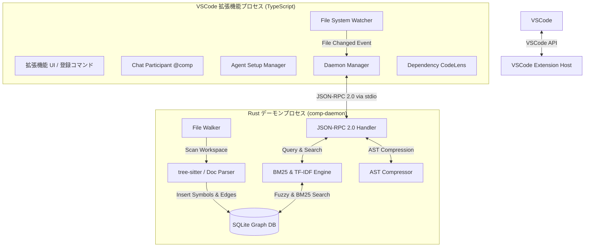

# comP アーキテクチャ設計書 (Architecture & Design)

comP は、AI コーディングエージェントに最適なコード文脈（コンテキスト）を効率的に提供するための、超軽量ローカルインデックスエンジンおよび VSCode 拡張機能です。
本書では、comP の全体システム設計、コンポーネント構成、データ構造、IPC 通信プロトコル、および主要アルゴリズムについて詳細に解説します。

---

## 1. 全体アーキテクチャ

comP は、VSCode のエコシステムと親和性の高い **TypeScript フロントエンド**と、高速な解析・検索処理を担当する **Rust バックエンド（デーモン）**の二層構成で設計されています。
両プロセスは標準入出力（`stdin` / `stdout`）を介した **JSON-RPC 2.0** プロトコルを用いて非同期で相互通信を行います。



---

## 2. フロントエンド: VSCode 拡張機能 (TypeScript)

フロントエンドは、ユーザーインターフェースの提供、ワークスペースの変更監視、および外部の AI コーディングエージェント（Claude Code、Cursor、Cline 等）への設定ファイルの自動マージを担当します。

### 主要コンポーネント

1. **`DaemonManager` ([DaemonManager.ts](file:///e:/dev/comP/src/daemon/DaemonManager.ts))**
   - Rust デーモン（`comp-daemon`）のライフサイクル管理。OS のプラットフォーム別バイナリ（Windows 用: `comp-daemon-win.exe`、macOS 用: `comp-daemon-macos`、Linux 用: `comp-daemon-linux`）を検出し、バックグラウンドプロセスとして起動します。
   - `stdin`/`stdout` によるストリーム通信をバッファリングし、JSON-RPC の Request/Response 連携およびタイムアウトを制御します。また、デーモンの突然死の際の自動再起動機構を有します。

2. **`SessionMemoryManager` ([sessionMemory.ts](file:///e:/dev/comP/src/mcp/sessionMemory.ts))**
   - セッション中の MCP ツール呼び出し（クエリ文字列、返却したシンボル情報、消費トークン数等）を `.comp/session-memory.json` に永続化します。
   - `workspace.onDidChangeTextDocument` などのファイル監視フックと連動し、クエリ実行後に該当ソースコードに変更が加わった場合、メモリ内の特定エントリに対して自動的に `stale` (新鮮ではない状態) フラグを付与します。

3. **`AgentSetupManager` ([AgentSetup.ts](file:///e:/dev/comP/src/mcp/AgentSetup.ts))**
   - ワークスペース内の設定ファイルを自動スキャンし、各 AI エージェントの MCP 構成ファイルに comP をサーバーとして登録します。
   - GitHub Copilot 連携用 (`.vscode/mcp.json`)、Cline 用 (`~/.config/Code/User/globalStorage/...`)、Cursor 用、Windsurf 用などのフォーマットへのシームレスなマージ・自動構築を行います。

4. **`DependencyCodeLensProvider` ([CodeLens.ts](file:///e:/dev/comP/src/ui/CodeLens.ts))**
   - クラスや関数の宣言上部に「X dependents（X件の依存元）」といった CodeLens インジケータを自動挿入します。クリック時に依存関係グラフをビジュアルまたはツリー表示できます。

---

## 3. バックエンド: Rust デーモン (`comp-daemon`)

バックエンドは、SQLite グラフレコードの構築、高速全文検索、tree-sitter による抽象構文木（AST）解析、各種ドキュメント（Office, PDF, Parquet）の解析を担当します。

### 主要コンポーネント

1. **`FileWalker` (`daemon/src/indexer/walker.rs`)**
   - ワークスペース内の全ファイルを再帰的に走査し、各ファイルの最終更新日時・ファイルハッシュを記録。変更のあったファイルのみを抽出してインデクサーに渡す差分インデックス機能を制御します。
   - 除外ルール（`.gitignore`、`.vscodeignore`）を評価し、不要な走査処理をスキップします。

2. **`DocumentParser` (`daemon/src/indexer/doc_parser.rs`)**
   - **ソースコード解析**: `tree-sitter` を用いて、Rust、TypeScript、Python、Go、HTML 等のファイルを構文解析し、関数、クラス、構造体、インターフェース、インポートなどのシンボル定義（`nodes`）と、シンボル間の参照・依存関係（`edges`）を抽出します。
   - **Office文書解析**: `zip` クレートと `quick-xml` を用いて、`.docx`、`.pptx`、`.xlsx` からテキスト情報を抽出。Excelのシート名やPowerPointのスライドを疑似的なモジュールシンボルとして登録します。
   - **PDF解析**: `lopdf` クレートを用いて PDF 内のテキストデータを抽出し、各ページを `Page N` シンボルとしてパースします。
   - **Parquetデータ解析**: `parquet2` クレートを用いて Parquet (`.parquet`) のスキーマメタデータおよび物理型情報を抽出し、全文検索用の BM25 テキストインデックスにマージします。

3. **`SearchEngine` (`daemon/src/search/mod.rs`)**
   - **BM25 検索**: 登録されたコード定義、コメント、および抽出ドキュメントテキスト（Office/PDF/Parquet）を対象に、BM25（Best Matching 25）アルゴリズムに基づいた高精度なキーワード全文検索を実行します。
   - **TF-IDF & LIKE 検索**: 曖昧一致 (LIKE 検索) と TF-IDF による語彙マッチングをマージし、エージェントの求めるファイルコンテキストの再現率（Recall）を最大化します。

4. **`DependencyAnalyzer` (`daemon/src/indexer/dependency.rs`)**
   - **依存抽出**: Rust / TypeScript / JavaScript / Python / Go のソースから、import・関数呼び出し・メソッド呼び出し・`new` による型参照を抽出します。定義行（`fn`/`def`/`func`/`function`）や制御構文キーワードは呼び出しとして誤検出しないよう除外します。
   - **2 パス・クロスファイル解決 (`resolve_global`)**: 全ファイルのノード登録後に、グローバルシンボル索引（`name → [(node_id, file_id, is_exported)]`）を用いてエッジを解決します。呼び出し元は「依存行の直前にある最近接シンボル」で近似し（`nodes` に `end_line` を持たないため）、呼び出し先は「同一ファイル → グローバル索引」の順で解決します。**同名の export が複数存在する曖昧なケースはエッジを張らず**、誤った依存（false edge）を防ぎます（再現率より精度を優先）。
   - 再インデックス時は `GraphDB::clear_file_edges` で当該ファイル発のエッジを再構築し、stale エッジの蓄積を防ぎます。

5. **`ASTCompressor` (`daemon/src/mcp/compress.rs`)**
   - 生成 AI エージェントの入力トークン数を削減するための、AST レベルでのテキスト圧縮エンジン。以下の3つのレベルをサポートします。
     - **Level 0 (Raw)**: 元のコードをそのまま返却。
     - **Level 1 (Compact)**: tree-sitter を利用して、コード内のコメント（ラインコメント・ブロックコメント）および冗長な空行を除去。
     - **Level 2 (Skeleton)**: 関数のシグネチャ（名前、引数、戻り値型）とクラス定義の枠組みだけを残し、関数の本体（`body`）を `{ ... }` に置換して非表示化。これにより、コンテキストの論理構造を崩さずにトークン数を 50% 〜 80% 削減します。

---

## 4. データベース・スキーマ (SQLite)

comP は、リポジトリ内の依存関係グラフ（コードグラフ）を永続化するために SQLite データベースを利用します。ファイルはローカルの `.comp/graph.db` に保存されます。

### テーブル設計

```sql
-- 1. ファイルテーブル: ワークスペース内の各ファイルを管理。差分検出用のハッシュ値を持つ。
CREATE TABLE IF NOT EXISTS files (
    path TEXT PRIMARY KEY,       -- ワークスペースルートからの相対パス
    hash TEXT NOT NULL,          -- ファイル内容の SHA-256 ハッシュ
    last_modified INTEGER NOT NULL, -- 最終更新タイムスタンプ
    is_stale INTEGER DEFAULT 0   -- コード変更監視による未更新フラグ (0: 有効, 1: 要再インデックス)
);

-- 2. ノードテーブル (シンボル): 各ファイルから抽出された宣言・定義情報。
CREATE TABLE IF NOT EXISTS nodes (
    id TEXT PRIMARY KEY,         -- シンボルのユニークID (ファイルパス + シンボル名)
    file_path TEXT NOT NULL,     -- 宣言元ファイルのパス (files.path への外部キー)
    name TEXT NOT NULL,          -- シンボル名 (例: "authenticate", "User")
    kind TEXT NOT NULL,          -- シンボル種別 (class, function, method, property, module 等)
    line INTEGER NOT NULL,       -- 開始行 (1-indexed)
    column INTEGER NOT NULL,     -- 開始列 (1-indexed)
    end_line INTEGER NOT NULL,   -- 終了行
    end_column INTEGER NOT NULL, -- 終了列
    signature TEXT,              -- シグネチャテキスト、またはプレビューデータ (最大200文字)
    is_exported INTEGER DEFAULT 0, -- エクスポートされているか (0: 内部のみ, 1: 外部公開)
    scope TEXT,                  -- 親スコープ名
    FOREIGN KEY(file_path) REFERENCES files(path) ON DELETE CASCADE
);

-- 3. エッジテーブル (依存関係): シンボル間の依存関係（有向グラフ）を保持。
CREATE TABLE IF NOT EXISTS edges (
    from_node TEXT NOT NULL,     -- 依存元シンボルID (nodes.id)
    to_node TEXT NOT NULL,       -- 依存先シンボルID (nodes.id)
    kind TEXT NOT NULL,          -- 依存関係の種類 (call, inherit, import 等)
    PRIMARY KEY (from_node, to_node, kind),
    FOREIGN KEY(from_node) REFERENCES nodes(id) ON DELETE CASCADE,
    FOREIGN KEY(to_node) REFERENCES nodes(id) ON DELETE CASCADE
);
```

---

## 5. IPC 通信プロトコル仕様 (JSON-RPC 2.0)

フロントエンドとバックエンドは以下のシリアライズされた JSON-RPC メッセージを送受信します。

### 代表的なメソッド

#### 1. `run_pipeline` (MCP 互換パイプライン検索)

AI エージェントが最初に呼び出すための最重要 API。タスク内容に基づき、関連ファイルをランク順にリストアップします。

- **リクエストパラメータ**:

  ```json
  {
    "jsonrpc": "2.0",
    "id": 1,
    "method": "run_pipeline",
    "params": {
      "task": "Fix JWT token expiration bug in authentication", // タスク内容 (要英語)
      "max_tokens": 8000,                                        // 許容トークン制限上限
      "include_content": true,                                   // ファイルコンテンツを直接含めるか
      "compression_level": 2                                     // コンテンツのAST圧縮レベル (0/1/2)
    }
  }
  ```

- **レスポンス**:

  ```json
  {
    "jsonrpc": "2.0",
    "id": 1,
    "result": {
      "pivot_files": [
        {
          "path": "src/auth/jwt.ts",
          "score": 0.892,
          "symbols": ["validateToken", "generateToken"],
          "token_count": 420,
          "content": "export function validateToken(...) { ... }" // 圧縮済みのソースコード
        }
      ],
      "token_savings": 54200,
      "cost_estimation": 0.023
    }
  }
  ```

#### 2. `get_symbol` (シンボル詳細情報取得)

特定のクラスや関数の定義と、その依存先・依存元関係を Markdown 形式で返却します。

- **リクエストパラメータ**:

  ```json
  {
    "jsonrpc": "2.0",
    "id": 2,
    "method": "get_symbol",
    "params": {
      "symbol_id": "src/auth/jwt.ts::validateToken",
      "compression_level": 1
    }
  }
  ```

#### 3. `get_git_diff_context` (Git 変更情報とシンボルマッピング)

Git の `git diff --name-only <base_ref>` 結果をもとに、変更されたファイル群から影響を受けるシンボルおよび依存グラフ上の影響範囲（Blast Radius）を特定し、AI エージェントにコンテキストとして返します。PR レビューに特化したツールです。

---

## 6. デザインポリシーと堅牢性

- **ゼロクラッシュ**: ドキュメント解析中の XML パースエラー、ZIP 展開失敗、tree-sitter のパース未対応構文に遭遇しても、エラー対象ファイルのみをスキップし、他のインデックス処理全体が異常停止しないよう徹底した `Result` ハンドリングを行っています。
- **低レイテンシ**: 重いインデックス作成とグラフ再構築は Rust デーモンのスレッドプールで非同期的に処理され、フロントエンドの UI スレッドをブロックしません。SQLite データベースへの一括挿入（トランザクション）により、ディスク I/O のオーバーヘッドを極限まで低減しています。
